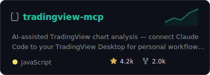
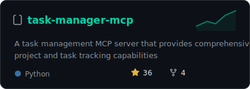
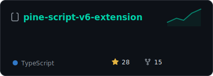
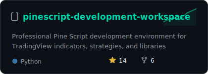
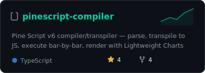
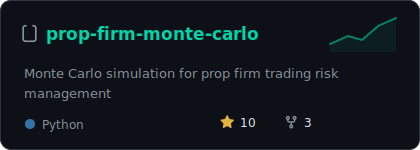
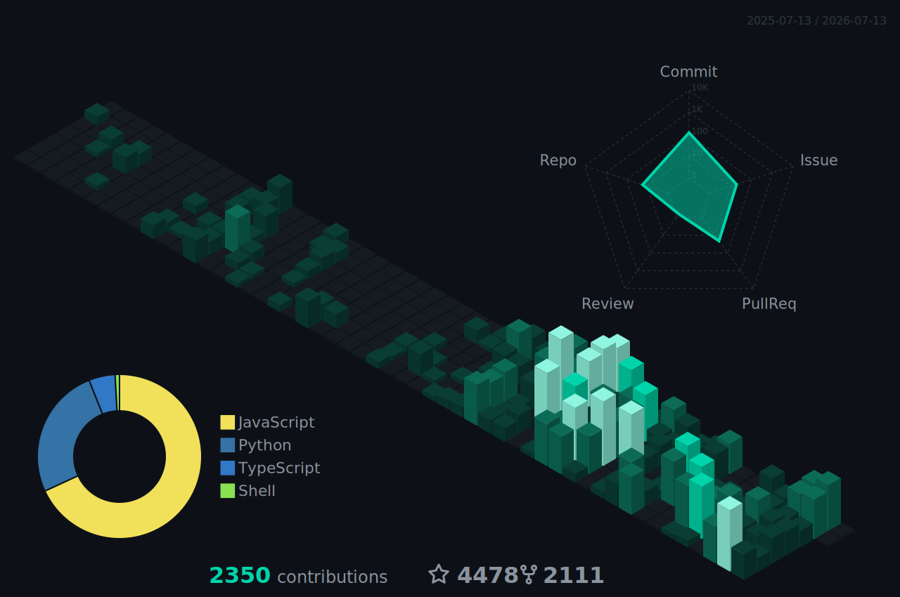

 

*I build the tools that sit between AI and the markets — MCP servers, Pine Script tooling, and trading automation. If a chart can be analyzed, a strategy can be coded, or a workflow can be automated, I'm probably shipping it.*

## 📈 shipping

cards regenerate weekly with live star counts — no third-party stat services to break

## 🧰 stack

## 📊 the tape

  

  

---

`opinions are noise. price is data. trades don't lie.`

